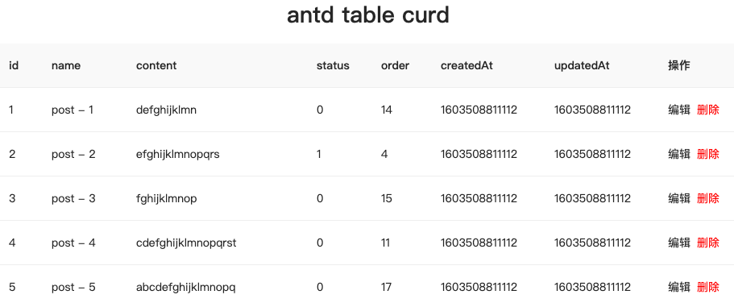
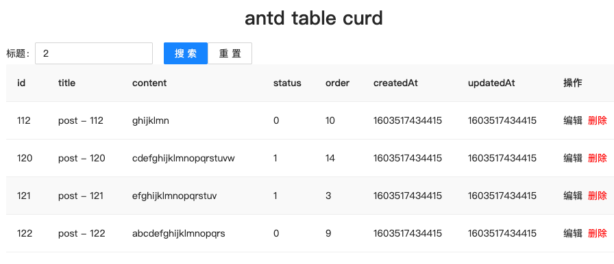
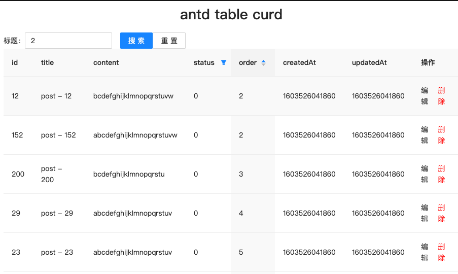

做了蛮多的后台管理页面, 几乎都是 table+弹窗表单. 所以总结一下自己 CRUD 的套路

假设这次要做一个关于文章 Post 的增删改查的需求

## 类型定义

```tsx
/** 文章 */
export interface Post {
  /** 主键 */
  id: number
  /** 标题 */
  title: string
  /** 内容 */
  content: string
  /** 状态 */
  status: PostStatus
  /** 排序字段 */
  order: number
  /** 创建时间, 时间戳 */
  createdAt: number
  /** 更新时间, 时间戳 */
  updatedAt: number
}
/** 文章状态 */
enum PostStatus {
  /** 草稿 */
  Draft = 0,
  /** 已发布 */
  Published = 1,
}
```

假设所有后端接口都满足 `API` 这个类型的定义

```tsx
/** 后端接口 */
export interface API<Response = unknown> {
  (...args: any[]): Promise<Response>
}
```

## 基本数据分页展示

首先, 我们要有一个获取文章列表的接口, 并且可以进行分页查询.
那么就来模拟一个接口, 取名为`getPosts`. 类型如下

```tsx
export interface GetPostsDto {
  /** @default 1 */
  page?: number
  /** @default 20 */
  pageSize?: number
}
export interface APIPagination {
  page: number
  total: number
  pageSize: number
}
export interface TableListResponse<T = unknown> {
  list: T[]
  pagination: APIPagination
}
// getPosts 的类型
type GetPosts = (dto?: GetPostsDto) => Promise<TableListResponse<Post>>
```

接口有了就可以写页面了

装好 antd 以后, 引入 Table 组件, 然后先一股脑地定义好 columns

```tsx
const columns: ColumnProps<Post>[] = [
  { dataIndex: 'id', title: 'id' },
  { dataIndex: 'title', title: 'title' },
  { dataIndex: 'content', title: 'content' },
  { dataIndex: 'status', title: 'status' },
  { dataIndex: 'order', title: 'order' },
  { dataIndex: 'createdAt', title: 'createdAt' },
  { dataIndex: 'updatedAt', title: 'updatedAt' },
  {
    render: () => (
      <Space>
        <span>编辑</span>
        <span style={{ color: 'red' }}>删除</span>
      </Space>
    ),
  },
]

export default function App() {
  return (
    <div className='App'>
      <h1>antd table curd</h1>
      <Table rowKey='id' dataSource={[]} columns={columns}></Table>
    </div>
  )
}
```

这样 table 就渲染出来了

接下来就想着怎么调用`getPosts`接口. 重新来看看 getPosts 的类型

```tsx
type GetPosts = (dto?: GetPostsDto) => Promise<TableListResponse<Post>>
```

我们需要一个 state 来存储查询参数`GetPostsDto`

```tsx
const [query, setQuery] = React.useState<GetPostsDto>({})
```

同时, 需要一个 state 来存储接口返回的数据 `TableListResponse<Post>`

```tsx
const [data, setData] = React.useState<TableListResponse<Post>>({
  list: [],
  pagination: {
    page: 1,
    pageSize: 20,
    total: 0,
  },
})
```

加个 loading

```tsx
const [loading, setLoading] = React.useState(false)
```

那就可以在 `React.useEffect` 调用接口了

```tsx
React.useEffect(() => {
  let isCurrent = true
  setLoading(true)
  getPosts(query)
    .then((res) => isCurrent && setData(res))
    .finally(() => isCurrent && setLoading(false))
  return () => {
    // 防止组件已经卸载的时候, 还会对已经卸载的组件setState
    isCurrent = false
  }
  // query每次变化的时候都会重新调用接口
}, [query])
```

这样的话, table 里就已经有数据了, 大概长这样


然后, 我们要在切换分页的时候, 重新发起请求调用接口. 只需要监听 table 的 onChange 函数, setQuery 即可(因为 query 每次变化的时候都会重新调用接口)

```tsx
onChange={(pagination) => {
  setQuery({
    page: pagination.current || 1,
    pageSize: pagination.pageSize || 20
  });
}}
```

当然, 如果只是关心分页的变化的话, 也可以在 Table 组件的 pagination 配置里监听分页的 onChange 函数, 而不是整个 table 的 onChange 函数

到这里, 页面的基本展示就完成了, 可以访问[https://codesandbox.io/s/smoosh-bash-pe3l3?file=/src/App.tsx](https://codesandbox.io/s/smoosh-bash-pe3l3?file=/src/App.tsx)来查看在线的 demo

## 顶部搜索表单

假设我们可以根据文章标题来进行模糊搜索, 需要在 table 上方添加一个输入框

更新搜索参数 `GetPostsDto`的类型定义为

```tsx
export interface GetPostsDto {
  /** @default 1 */
  page?: number
  /** @default 20 */
  pageSize?: number
  title?: string
}
```

接着使用 antd 的 Form 组件来创建一个业务表单组件, 取名为 SearchForm

```tsx
interface FormValues {
  title?: string
}
export function SearchForm(props: {
  onSubmit: (values: FormValues) => any
  onReset: (values: FormValues) => any
}) {
  const { onSubmit, onReset } = props
  const [form] = Form.useForm<FormValues>()
  const handleReset = () => {
    form.resetFields()
    onReset({ title: undefined })
  }
  return (
    <Form form={form} layout='inline' onFinish={onSubmit}>
      <Form.Item name='title' label='标题'>
        <Input placeholder='文章标题' />
      </Form.Item>
      <Button htmlType='submit' type='primary'>
        搜索
      </Button>
      <Button htmlType='button' onClick={handleReset}>
        重置
      </Button>
    </Form>
  )
}
```

我们希望用户点击搜索或者重置的时候, 都重新发起请求来刷新 table 的数据. 显然我们又需要修改 `query` 这个 state

```tsx
<SearchForm
  onSubmit={(values) =>
    setQuery((prev) => ({
      ...prev,
      ...values,
      page: 1, // 重置分页
    }))
  }
  onReset={(values) =>
    setQuery((prev) => ({
      ...prev,
      ...values,
      page: 1, // 重置分页
    }))
  }
/>
```

注意这里, 我们用了 setQuery 传递了一个函数, 同时结合展开运算符, 达到了 Class Component 里 this.setState 合并更新对象的效果, 参考[React 文档](https://zh-hans.reactjs.org/docs/hooks-reference.html#usestate)

因为, 我们不希望点击搜索传递了`title`参数时, 就把之前可能已经存在的 `pageSize` 等参数丢掉

同理, table 里的 onChange 函数也要进行同样的操作, 不能因为切换分页就把可能已经存在的`title`参数丢了

```tsx
onChange={(pagination) => {
  setQuery((prev) => ({
    ...prev,
    page: pagination.current || 1,
    pageSize: pagination.pageSize || 20
  }));
}}
```

这个时候给表格大概是长这样的

查看在线 demo [https://codesandbox.io/s/great-black-6mvm2?file=/src/App.tsx](https://codesandbox.io/s/great-black-6mvm2?file=/src/App.tsx)

### 表单校验

接着, 来思考一个有趣的问题. 假设这个 title 的输入框, 用户输入一个超长的字符串, 那么前端要做一些限制吗? 不同的应用可能有不同的答案

- 像谷歌的搜索框, 我试了最多只能输入 2048 个字符, 因为它会把这个搜索的字符串加到 url 里, url 显然是有长度限制的(具体看实现), 所以也很合理.B 站的搜索框也做了类似的处理, 但是限制在了 100 个字符
- 阿里云的用户中心里, 对于订单号这个 input, 前端并没有做长度上的校验/过滤, 而是直接丢给后端, 然后后管返回系统异常前端弹窗提示
- 我平时的工作里, 后台管理系统中, 产品要求直接崩掉这次操作, 给用户提示字符过长之类的

个人来看的话, 我觉得直接过滤掉用户的输入/限制用户的输入, 但是不崩掉用户的请求会比较好. 比如说 “输入框输入 n 个字符串就不能再输入”, “数字 id 输入框就只能输入数字”, “antd 的 InputNumber 可以输入别的字符, 但是 blur 或者提交的时候会清掉”, “合理的情况下使用可以选择的控件而不是输入框(Select, Picker, 带搜索的 Select 等)”.

### 输入了, 但是没有点击搜索

假设一个用户更新了输入框, 但是没有点击搜索按钮, 这时候用户点击下一页等时候, 我应该带上视觉上已经更新了的 title 参数吗?

纠结过一下后我还是觉得这是用户傻逼, 你不点击搜索来提交我为什么要带, 而且带的话我是不是又要考虑一下表单校验怎么处理? 但是还是得看产品选择怎么搞了

## 筛选和排序

假设我们可以根据文章状态来在表格列进行筛选, 并且可以根据 Post 的 order 字段来排序

更新搜索参数 `GetPostsDto`的类型定义为

```tsx
export interface GetPostsDto {
  /** @default 1 */
  page?: number
  /** @default 20 */
  pageSize?: number
  title?: string
  /** 0升序 1降序 */
  order?: 0 | 1
  status?: PostStatus
}
```

可以看到, 对于接口来说 , 没有什么不同的, 就是加了两个字段而已; 那么对于前端来讲, 也没什么不同的, 就是搜索参数来自于不同的 UI 控件而已, 对于到代码还是那一句 `setQuery`

更新 columns status 那一栏

```tsx
  {
    dataIndex: "status",
    title: "status",
    filters: [
      { text: "0", value: 0 },
      { text: "1", value: 1 },
    ],
    filterMultiple: false,
  },
```

同时, 对应的 table 的 onChange 函数也更新一下. 同时因为这里使用了 antd 的 table, 得对它给我们的一些数据结构进行一下处理, 让它符合接口的规范

```tsx
  onChange={(pagination, filters) => {
  setQuery((prev) => ({
    ...prev,
    page: pagination.current || 1,
    pageSize: pagination.pageSize || 20,
    status:
      filters.status && filters.status.length > 0 ? Number(filters.status[0]) : undefined,
  }))
}}
```

排序也差不多

```tsx
{ dataIndex: 'order', title: 'order', sorter: true },


onChange={(pagination, filters, sorter) => {
  setQuery((prev) => ({
    ...prev,
    page: pagination.current || 1,
    pageSize: pagination.pageSize || 20,
    status:
      filters.status && filters.status.length > 0 ? Number(filters.status[0]) : undefined,
    order:
      !Array.isArray(sorter) && !!sorter.order && sorter.field === 'order'
        ? ({ ascend: 0, descend: 1 } as const)[sorter.order]
        : undefined,
  }))
}}
```

这时候数据结构就有点恶心了, 要转来转去. 没办法, ui 要用的数据结构和接口要用的数据结构, 用途都不一样那就很难一致. 至于多列排序也是类似的, 就是处理的 sorter 变成一个数组而已

这个时候表格大概是长这个样子的



查看在线 demo [https://codesandbox.io/s/async-moon-vjllu?file=/src/App.tsx](https://codesandbox.io/s/async-moon-vjllu?file=/src/App.tsx)

## 从 url 获取参数初始化查询条件

url 参数我们在任何组件都可以拿, 但是消费这些 url 参数的, 是`query`这个 state, 对应到 UI 上, 就有可能是顶部的`SearchForm`, table 里列的 sorter 和 filter, 所以拿 url 参数这个动作, 最好是直接在页面组件里搞也就是现在示例用的 `App.tsx`

这里安装[qs](https://github.com/ljharb/qs)这个库, 用于 url querysring 的解析和序列化

```bash
yarn add qs
yarn add -D @types/qs
```

先写一个函数, 获取最初的查询条件

```tsx
function getDefaultQuery() {
  // 先不考虑服务端渲染
  const urlSearchParams = qs.parse(window.location.search, {
    ignoreQueryPrefix: true,
  })
  const { page, pageSize, title, status, order } = urlSearchParams
  const dto: GetPostsDto = {}
  if (typeof page === 'string') {
    dto.page = validIntOrUndefiend(page) || 1
  }
  if (typeof pageSize === 'string') {
    dto.pageSize = validIntOrUndefiend(pageSize) || 20
  }
  if (typeof title === 'string') {
    dto.title = title
  }
  if (typeof status === 'string') {
    dto.status = validIntOrUndefiend(status)
  }
  if (typeof order === 'string') {
    const orderNum = validIntOrUndefiend(order)
    dto.order = orderNum ? (clamp(orderNum, 0, 1) as 0 | 1) : undefined
  }
  return dto
}
```

声明多一个叫 `defaultQuery` 的 state, 用`getDefaultQuery`来初始化它
再用`defaultQuery`来初始化`query`

```tsx
const [defaultQuery, setDefaultQuery] = React.useState<GetPostsDto>(
  getInitialQuery
)
const [query, setQuery] = React.useState<GetPostsDto>(defaultQuery)
```

为什么要加多一个 `defaultQuery` 呢? 因为要把它传给`SearchForm`, 来同步初始化表单的值

```tsx
;<SearchForm
  defaultQuery={defaultQuery}
  //...
/>

export function SearchForm(props: {
  onSubmit: (values: FormValues) => any
  onReset: (values: FormValues) => any
  defaultQuery?: GetPostsDto
}) {
  const { onSubmit, onReset, defaultQuery } = props
  const [form] = Form.useForm<FormValues>()
  const handleReset = () => {
    form.resetFields()
    onReset({ title: undefined })
  }
  React.useEffect(() => {
    if (!defaultQuery) {
      return
    }
    const { title } = defaultQuery
    if (title) {
      form.setFieldsValue({ title })
    }
  }, [form, defaultQuery])
  return (
    <Form form={form} layout='inline' onFinish={onSubmit}>
      <Form.Item name='title' label='标题'>
        <Input placeholder='文章标题' maxLength={10} />
      </Form.Item>
      <Button htmlType='submit' type='primary'>
        搜索
      </Button>
      <Button htmlType='button' onClick={handleReset}>
        重置
      </Button>
    </Form>
  )
}
```

对于 filter 和 sorter, antd 的 columns 提供了对应的受控属性, 将它传进去就好了

```tsx
  {
    dataIndex: 'status',
    title: 'status',
    filters: [
      { text: '0', value: 0 },
      { text: '1', value: 1 },
    ],
    filterMultiple: false,
    filteredValue: query.status === undefined ? undefined : [query.status.toString()],
  },
  {
    dataIndex: 'order',
    title: 'order',
    sorter: true,
    sortOrder:
      query.order === undefined
        ? undefined
        : ({ 0: 'ascend', 1: 'descend' } as const)[query.order],
  },
```

但是很重要的一点是, **必须将 columns 移入 App 组件内了**, 因为 columns 依赖了 query 这个 state, 必须放进去才能每次都获取最新的 query

### 同步 query 到 url

反向操作, 在 query 每次变化的时候都将其同步到 url

```tsx
React.useEffect(() => {
  const { protocol, host, pathname } = window.location
  const newurl = `${protocol}//${host}${pathname}?${qs.stringify(query)}`
  window.history.replaceState(null, '', newurl)
  // query每次变化的时候同步参数到url
}, [query])
```

这里直接使用 window.history 的 api, 实际项目里, 比如你用 react-router 的就用 react-router 的 api 就行了

其实这个功能我做得比较少, 除非产品明确要求不然我都是不做...不过做了会对用户会比较友好

查看在线 demo [https://codesandbox.io/s/cool-cookies-y930f?file=/src/App.tsx](https://codesandbox.io/s/cool-cookies-y930f?file=/src/App.tsx)

## 弹窗表单

CRUD 中的 Read 已经搞得差不多, 接着看看剩下来的增删改

但是开工前先思考一个问题, 现在增删改就有三个弹窗了, 而且你永远不知道产品会在一个页面下塞下多少个弹窗

假设一个弹窗对应一个 `visible` 的 state 和一个 `Modal`组件, 如果有个 n 个弹窗, 我们是不是要像下面那样写 n 次呢?

```tsx
function Page() {
  const [visible1, setVisible1] = React.useState(false)
  const [visible2, setVisible2] = React.useState(false)
  const [visible3, setVisible3] = React.useState(false)
  const [visiblen, setVisiblen] = React.useState(false)

  return (
    <>
      <Modal title='Modal1' visible={visible1}></Modal>
      <Modal title='Modal2' visible={visible2}></Modal>
      <Modal title='Modal3' visible={visible3}></Modal>
      <Modal title='Modaln' visible={visible4}></Modal>
    </>
  )
}
```

如果每个弹窗还都要加上一个 loading 状态等等的话, 那么 Page 里的 state 就太多了

但是没写过的话光这样看是看不出什么鬼来的, 所以还是先写吧

## Create

首先还是要有一个接口啊, 假设我们有一个叫 `createPost` 的接口, 类型定义如下:

```tsx
type CreatePostDto = {
  title: string
  content: string
  status: PostStatus
  order: number
}
type CreatePost = (
  dto: CreatePostDto
) => Promise<{
  id: number
}>
```

根据 [antd 里的文档](https://ant.design/components/form-cn/#components-form-demo-form-in-modal), 一个弹窗的里的新建表单可以这样搞, 那就哐哐哐照抄

创建一个叫 `CreateForm`的组件

```tsx
export function CreatForm(props: {
  visible: boolean
  onCreate: (dto: CreatePostDto) => void
  onCancel: () => void
  loading: boolean
}) {
  const { visible, onCancel, onCreate, loading } = props
  const [form] = Form.useForm()
  const handleSubmit = () => {
    form.validateFields().then((values) => {
      onCreate(values as CreatePostDto)
    })
  }
  return (
    <Modal
      title='Create Post'
      visible={visible}
      onCancel={onCancel}
      onOk={handleSubmit}
      okButtonProps={{ loading }}
    >
      <Form form={form} labelCol={{ span: 6 }} wrapperCol={{ span: 18 }}>
        <Form.Item
          name='title'
          label='title'
          rules={[
            {
              required: true,
              message: 'title is required',
            },
          ]}
        >
          <Input></Input>
        </Form.Item>
        <Form.Item
          name='content'
          label='content'
          rules={[
            {
              required: true,
              message: 'content is required',
            },
          ]}
        >
          <Input.TextArea></Input.TextArea>
        </Form.Item>
        <Form.Item
          name='status'
          label='status'
          initialValue={PostStatus.Draft}
          required
        >
          <Radio.Group>
            <Radio value={PostStatus.Draft}>draft</Radio>
            <Radio value={PostStatus.Published}>published</Radio>
          </Radio.Group>
        </Form.Item>
        <Form.Item
          name='order'
          label='order'
          rules={[
            {
              required: true,
              message: 'order is required',
            },
          ]}
          initialValue={1}
        >
          <InputNumber min={1}></InputNumber>
        </Form.Item>
      </Form>
    </Modal>
  )
}
```

然后在页面组件引入,并且声明相关状态以及绑定事件

```tsx
const [createVisible, setCreateVisible] = React.useState(false)
const [createLoading, setCreateLoading] = React.useState(false)
//...
<CreatForm
  visible={createVisible}
  onCreate={async (values: CreatePostDto) => {
    setCreateLoading(true)
    try {
      await createPost(values)
      message.success('创建成功')
      // 刷新列表
      setQuery((prev) => ({
        ...prev,
      }))
      setCreateVisible(false)
    } catch (e) {
      message.error('创建失败')
    } finally {
      setCreateLoading(false)
    }
  }}
  onCancel={() => setCreateVisible(false)}
  loading={createLoading}
/>
```

查看在线 demo [https://codesandbox.io/s/tender-tu-yw5tx?file=/src/App.tsx](https://codesandbox.io/s/tender-tu-yw5tx?file=/src/App.tsx)

注意我们的接口都是模拟的, 每次刷新页面数据都会重新生成

## Update

接下来就是编辑了, 照样先看接口类型, 我们叫它`updatePost`

```tsx
type UpdatePostDto = Partial<Post> & { id: number }
type UpdatePost = (dto: CreatePostDto) => Promise<void>
```

更新文章 id 是必传的, 其他字段不传就不更新

一般来讲, 我们的创建表单和编辑表单都是可以复用同一个组件的. 同时我们也需要当前编辑的 Post 数据来初始化表单

将`CreateForm`重命名为`PostForm`

```tsx
interface FormValues {
  title: string
  content: string
  status: PostStatus
  order: number
}
export function PostForm(props: {
  visible: boolean
  title: string
  loading: boolean
  onCancel: () => void
  onCreate?: (dto: CreatePostDto) => void
  onUpdate?: (dto: UpdatePostDto) => void
  record?: Post
}) {
  const {
    visible,
    onCancel,
    onCreate,
    onUpdate,
    loading,
    record,
    title,
  } = props
  const [form] = Form.useForm<FormValues>()
  const handleSubmit = () => {
    form.validateFields().then((values) => {
      if (record) {
        onUpdate &&
          onUpdate({
            ...values,
            id: record.id,
          } as UpdatePostDto)
      } else {
        onCreate && onCreate(values as CreatePostDto)
      }
    })
  }

  // 初始化表单
  React.useEffect(() => {
    form.setFieldsValue({
      title: record?.title,
      content: record?.content,
      status: record ? record.status : PostStatus.Draft,
      order: record?.order || 1,
    })
  }, [record, form])

  return (
    <Modal
      title={title}
      visible={visible}
      onCancel={onCancel}
      onOk={handleSubmit}
      okButtonProps={{ loading }}
    >
      <Form form={form} labelCol={{ span: 6 }} wrapperCol={{ span: 18 }}>
        <Form.Item
          name='title'
          label='title'
          rules={[
            {
              required: true,
              message: 'title is required',
            },
          ]}
        >
          <Input></Input>
        </Form.Item>
        <Form.Item
          name='content'
          label='content'
          rules={[
            {
              required: true,
              message: 'content is required',
            },
          ]}
        >
          <Input.TextArea></Input.TextArea>
        </Form.Item>
        <Form.Item name='status' label='status' required>
          <Radio.Group>
            <Radio value={PostStatus.Draft}>draft</Radio>
            <Radio value={PostStatus.Published}>published</Radio>
          </Radio.Group>
        </Form.Item>
        <Form.Item
          name='order'
          label='order'
          rules={[
            {
              required: true,
              message: 'order is required',
            },
          ]}
        >
          <InputNumber min={1}></InputNumber>
        </Form.Item>
      </Form>
    </Modal>
  )
}
```

props 的变更: 增加 `onUpdate`, `record`,`title`, 将`onCreate`变成 optional 的

同时注意到, 我们将比表单初始化的工作放在`React.useEffect`来做了, 因为 `Form.Item`的`initialValue`属性和非受控 input 的`defaultValue`一样, 在组件第一次渲染之后就没用了影响不到后续的更新

然后在页面组件里, 照之前的 CreateForm 来一套就好了

```tsx
<PostForm
  title='Update Post'
  record={selectedRecord}
  visible={updateVisible}
  onUpdate={async (values: UpdatePostDto) => {
    setUpdateLoading(true)
    try {
      await updatePost(values)
      message.success('编辑成功')
      // 刷新列表
      setQuery((prev) => ({
        ...prev,
      }))
      setUpdateVisible(false)
    } catch (e) {
      message.error('编辑失败')
    } finally {
      setUpdateLoading(false)
    }
  }}
  onCancel={() => setUpdateVisible(false)}
  loading={updateLoading}
/>
```

注意到这里需要一个 record 属性, 也就是当前编辑的 Post, 我们需要一个声明一个 state 来保存它

```tsx
const [selectedRecord, setSelectedRecord] = React.useState<Post>()
```

触发事件的时候:

```tsx
{
  title: '操作',
  render: (_, record) => (
    <Space>
      <span
        style={{ cursor: 'pointer' }}
        onClick={() => {
          setSelectedRecord(record)
          setUpdateVisible(true)
        }}
      >
        编辑
      </span>
      <span style={{ color: 'red', cursor: 'pointer' }}>删除</span>
    </Space>
  ),
},
```

这样就搞定了,查看在线 demo, [https://codesandbox.io/s/happy-haibt-oh1hx?file=/src/App.tsx](https://codesandbox.io/s/happy-haibt-oh1hx?file=/src/App.tsx)

### 编辑的时候需要额外调用接口

这也是个比较常见的需求, 有时候一些额外的字段在表格的 list 接口可能并没有, 需要调用额外的接口去拿. 如果是这种情况的话, 我们的 `PostForm`的 props 一样可以保持不变, 根据传进来的`record`也就是当前 Post 的信息去调用接口, 然后再设置表单的值就可以了

## Delete

接下来搞删除, 假设我们的接口叫 `deletePost`, 类型如下:

```tsx
type DeletePost = (id: number) => Promise<void>
```

删除的话, 这里我们使用 antd 的`Modal.confirm`.   而且这里 onOk 返回一个 Promise 的话可以给按钮加 loading, 这样=我们就不用再声明多一个 loading 状态了

```tsx
function handleDelete(record: Post, onSuccess: () => void) {
  Modal.confirm({
    title: 'Delete Post',
    content: <p>确定删除 {record.title} 吗?</p>,
    onOk: async () => {
      try {
        await deletePost(record.id)
        message.success('删除成功')
        onSuccess()
      } catch (e) {
        message.error('删除失败')
      }
    },
  })
}
```

事件绑定:

```tsx
{
  title: '操作',
  render: (_, record) => (
    <Space>
      <span
        style={{ cursor: 'pointer' }}
        onClick={() => {
          setSelectedRecord(record)
          setUpdateVisible(true)
        }}
      >
        编辑
      </span>
      <span
        style={{ color: 'red', cursor: 'pointer' }}
        onClick={() =>
          handleDelete(record, () =>
            setQuery((prev) => {
              const prevPage = prev.page || 1
              return {
                ...prev,
                page: data.list.length === 1 ? clamp(prevPage - 1, 1, prevPage) : prevPage,
              }
            })
          )
        }
      >
        删除
      </span>
    </Space>
  ),
}
```

这里有个稍微要注意的地方, 就是当前页面只有最后一条数据了, 如果我们删除了这一条数据还传原来的页码过去, 那么用户看到的就是没数据的页面, 会有点奇怪, 所以把页码减了一页

查看在线 demo, [https://codesandbox.io/s/beautiful-meitner-yu902?file=/src/App.tsx](https://codesandbox.io/s/beautiful-meitner-yu902?file=/src/App.tsx)

我挺喜欢 Modal.confirm 这个语法糖的, 对于这种不需要填表单的操作, 是很方便的

## 批量操作

假设产品跟我们讲, 需要一个批量发布文章的按钮, 那么我们需要一个批量更改文章状态的接口. 假设它叫 `batchUpdatePostsStatus`

类型定义如下:

```tsx
type BatchUpdatePostsStatusDto = {
  ids: number[]
  status: PostStatus
}
type BatchUpdatePostsStatus = (dto: BatchUpdatePostsDto) => Promise<void>
```

其实我们像之前删除那样子搞就好了, 但是为了把事情搞得复杂一点, 产品说在批量发布的时候, 必须需要加上一个备注. 所以我们得像创建和编辑那样, 搞一个弹窗表单了.

`BatchUpdatePostsStatusDto` 的类型更新为

```tsx
type BatchUpdatePostsStatusDto = {
  ids: number[]
  status: PostStatus
  /** 备注 */
  remark: string
}
```

创建表单

```tsx
interface FormValues {
  status: PostStatus
  remark: string
}
export function BatchUpdatePostsStatusForm(props: {
  visible: boolean
  loading: boolean
  records: Post[]
  onCancel: () => void
  onSubmit: (dto: BatchUpdatePostsStatusDto) => Promise<void>
}) {
  const { visible, onCancel, onSubmit, loading, records } = props
  const [form] = Form.useForm<FormValues>()
  const handleSubmit = () => {
    form.validateFields().then(async (values) => {
      await onSubmit({
        ...values,
        ids: records.map((item) => item.id),
      } as BatchUpdatePostsStatusDto)
      // 更新完重置表单
      form.resetFields()
    })
  }

  return (
    <Modal
      title='批量更新文章状态'
      visible={visible}
      onCancel={onCancel}
      onOk={handleSubmit}
      okButtonProps={{ loading }}
    >
      <Form form={form} labelCol={{ span: 6 }} wrapperCol={{ span: 18 }}>
        <Form.Item
          name='remark'
          label='remark'
          rules={[
            {
              required: true,
              message: 'remark is required',
            },
          ]}
        >
          <Input.TextArea placeholder='填写备注'></Input.TextArea>
        </Form.Item>
        <Form.Item
          name='status'
          label='status'
          required
          initialValue={PostStatus.Draft}
        >
          <Radio.Group>
            <Radio value={PostStatus.Draft}>draft 0</Radio>
            <Radio value={PostStatus.Published}>published 1</Radio>
          </Radio.Group>
        </Form.Item>
      </Form>
    </Modal>
  )
}
```

添加所需要的状态, 包括多选的 row

```tsx
const [selectedRows, setSelectedRows] = React.useState<Post[]>([])
const [batchUpdateStatusVisible, setBatchUpdateStatusVisible] = React.useState(
  false
)
const [batchUpdateStatusLoading, setBatchUpdateStatusLoading] = React.useState(
  false
)
```

渲染表单

```tsx
<BatchUpdatePostsStatusForm
  // @see https://ant.design/components/form-cn/#FAQ
  forceRender
  visible={batchUpdateStatusVisible}
  records={selectedRows}
  loading={batchUpdateStatusLoading}
  onCancel={() => {
    setBatchUpdateStatusVisible(false)
    setSelectedRows([])
  }}
  onSubmit={async (values: BatchUpdatePostsStatusDto) => {
    setBatchUpdateStatusLoading(true)
    try {
      await batchUpdatePostsStatus(values)
      message.success('批量编辑成功')
      // 刷新列表
      setQuery((prev) => ({
        ...prev,
      }))
      setBatchUpdateStatusVisible(false)
      setSelectedRows([])
    } catch (e) {
      message.error('批量编辑失败')
    } finally {
      setBatchUpdateStatusLoading(false)
    }
  }}
/>
```

绑定事件

```tsx
 <Button
  type='primary'
  disabled={selectedRows.length <= 0}
  onClick={() => {
    setBatchUpdateStatusVisible(true)
  }}
>
  批量更新文章状态
</Button>

<Table
  rowSelection={{
    selectedRowKeys: selectedRows.map((item) => item.id),
    onChange: (_, rows) => setSelectedRows(rows),
  }}
/>
```

好了反正就是来一套, 查看线上 demo,[https://codesandbox.io/s/proud-darkness-96qk2?file=/src/App.tsx](https://codesandbox.io/s/proud-darkness-96qk2?file=/src/App.tsx)

现在 App.tsx 这个文件内容有大概 317 行了, 下一步来看看能不能在写法上优化一下 (不过我觉着还好, 起码挺工整的...)

## 提取接口获取数据逻辑至外部

来观察一下现在的 App 组件

```tsx
function App() {
  const [defaultQuery] = React.useState<GetPostsDto>(getDefaultQuery)
  const [query, setQuery] = React.useState<GetPostsDto>(defaultQuery)
  const [data, setData] = React.useState<TableListResponse<Post>>({
    list: [],
    pagination: {
      page: 1,
      pageSize: 20,
      total: 0,
    },
  })
  const [loading, setLoading] = React.useState(false)
  const [selectedRecord, setSelectedRecord] = React.useState<Post>()
  const [selectedRows, setSelectedRows] = React.useState<Post[]>([])

  const [createVisible, setCreateVisible] = React.useState(false)
  const [createLoading, setCreateLoading] = React.useState(false)
  const [updateVisible, setUpdateVisible] = React.useState(false)
  const [updateLoading, setUpdateLoading] = React.useState(false)
  const [
    batchUpdateStatusVisible,
    setBatchUpdateStatusVisible,
  ] = React.useState(false)
  const [
    batchUpdateStatusLoading,
    setBatchUpdateStatusLoading,
  ] = React.useState(false)

  const columns: ColumnProps<Post>[] = [
    { dataIndex: 'id', title: 'id' },
    { dataIndex: 'title', title: 'title' },
    { dataIndex: 'content', title: 'content' },
    {
      dataIndex: 'status',
      title: 'status',
      filters: [
        { text: '0', value: 0 },
        { text: '1', value: 1 },
      ],
      filterMultiple: false,
      filteredValue:
        query.status === undefined ? undefined : [query.status.toString()],
    },
    {
      dataIndex: 'order',
      title: 'order',
      sorter: true,
      sortOrder:
        query.order === undefined
          ? undefined
          : ({ 0: 'ascend', 1: 'descend' } as const)[query.order],
    },
    { dataIndex: 'createdAt', title: 'createdAt', sorter: true },
    { dataIndex: 'updatedAt', title: 'updatedAt' },
    {
      title: '操作',
      render: (_, record) => (
        <Space>
          <span
            style={{ cursor: 'pointer' }}
            onClick={() => {
              setSelectedRecord(record)
              setUpdateVisible(true)
            }}
          >
            编辑
          </span>
          <span
            style={{ color: 'red', cursor: 'pointer' }}
            onClick={() =>
              handleDelete(record, () =>
                setQuery((prev) => {
                  const prevPage = prev.page || 1
                  return {
                    ...prev,
                    page:
                      data.list.length === 1
                        ? clamp(prevPage - 1, 1, prevPage)
                        : prevPage,
                  }
                })
              )
            }
          >
            删除
          </span>
        </Space>
      ),
    },
  ]

  React.useEffect(() => {
    let isCurrent = true
    setLoading(true)
    getPosts(query)
      .then((res) => isCurrent && setData(res))
      .finally(() => isCurrent && setLoading(false))
    return () => {
      // 防止组件已经卸载的时候, 还会对已经卸载的组件setState
      isCurrent = false
    }
    // query每次变化的时候都会重新调用接口
  }, [query])

  React.useEffect(() => {
    const { protocol, host, pathname } = window.location
    const newurl = `${protocol}//${host}${pathname}?${qs.stringify(query)}`
    window.history.replaceState(null, '', newurl)
    // query每次变化的时候同步参数到url
  }, [query])

  return (
    <div>
      <h1>antd table crud</h1>
      <SearchForm
        defaultQuery={defaultQuery}
        onSubmit={(values) =>
          setQuery((prev) => ({
            ...prev,
            ...values,
            page: 1, // 重置分页
          }))
        }
        onReset={(values) =>
          setQuery((prev) => ({
            ...prev,
            ...values,
            page: 1, // 重置分页
          }))
        }
      />
      <div style={{ margin: '15px 0' }}>
        <Space>
          <Button type='primary' onClick={() => setCreateVisible(true)}>
            Create
          </Button>

          <Button
            type='primary'
            disabled={selectedRows.length <= 0}
            onClick={() => {
              setBatchUpdateStatusVisible(true)
            }}
          >
            批量更新文章状态
          </Button>
        </Space>
      </div>
      <Table
        rowKey='id'
        dataSource={data.list}
        columns={columns}
        loading={loading}
        pagination={{ ...antdPaginationAdapter(data.pagination) }}
        onChange={(pagination, filters, sorter) => {
          setQuery((prev) => ({
            ...prev,
            page: pagination.current || 1,
            pageSize: pagination.pageSize || 20,
            status:
              filters.status && filters.status.length > 0
                ? Number(filters.status[0])
                : undefined,
            order:
              !Array.isArray(sorter) &&
              !!sorter.order &&
              sorter.field === 'order'
                ? ({ ascend: 0, descend: 1 } as const)[sorter.order]
                : undefined,
          }))
        }}
        rowSelection={{
          selectedRowKeys: selectedRows.map((item) => item.id),
          onChange: (_, rows) => setSelectedRows(rows),
        }}
      ></Table>
      <PostForm
        title='Create Post'
        visible={createVisible}
        onCreate={async (values: CreatePostDto) => {
          setCreateLoading(true)
          try {
            await createPost(values)
            message.success('创建成功')
            // 刷新列表
            setQuery((prev) => ({
              ...prev,
            }))
            setCreateVisible(false)
          } catch (e) {
            message.error('创建失败')
          } finally {
            setCreateLoading(false)
          }
        }}
        onCancel={() => setCreateVisible(false)}
        loading={createLoading}
      />
      <PostForm
        title='Update Post'
        record={selectedRecord}
        visible={updateVisible}
        onUpdate={async (values: UpdatePostDto) => {
          setUpdateLoading(true)
          try {
            await updatePost(values)
            message.success('编辑成功')
            // 刷新列表
            setQuery((prev) => ({
              ...prev,
            }))
            setUpdateVisible(false)
          } catch (e) {
            message.error('编辑失败')
          } finally {
            setUpdateLoading(false)
          }
        }}
        onCancel={() => setUpdateVisible(false)}
        loading={updateLoading}
      />
      <BatchUpdatePostsStatusForm
        visible={batchUpdateStatusVisible}
        records={selectedRows}
        loading={batchUpdateStatusLoading}
        onCancel={() => {
          setBatchUpdateStatusVisible(false)
          setSelectedRows([])
        }}
        onSubmit={async (values: BatchUpdatePostsStatusDto) => {
          setBatchUpdateStatusLoading(true)
          try {
            await batchUpdatePostsStatus(values)
            message.success('批量编辑成功')
            // 刷新列表
            setQuery((prev) => ({
              ...prev,
            }))
            setBatchUpdateStatusVisible(false)
            setSelectedRows([])
          } catch (e) {
            message.error('批量编辑失败')
          } finally {
            setBatchUpdateStatusLoading(false)
          }
        }}
      />
    </div>
  )
}
```

首先, 获取根据 query 获取 table 数据这个套路是很固定的, 我们完全可以把它提取到 App 组件外面, 形成一个叫 `usePosts` 的函数

```tsx
function usePosts(defaultQuery: GetPostsDto) {
  const [query, setQuery] = React.useState<GetPostsDto>(defaultQuery)
  const [data, setData] = React.useState<TableListResponse<Post>>({
    list: [],
    pagination: {
      page: 1,
      pageSize: 20,
      total: 0,
    },
  })
  const [loading, setLoading] = React.useState(false)

  React.useEffect(() => {
    let isCurrent = true
    setLoading(true)
    getPosts(query)
      .then((res) => isCurrent && setData(res))
      .finally(() => isCurrent && setLoading(false))
    return () => {
      // 防止组件已经卸载的时候, 还会对已经卸载的组件setState
      isCurrent = false
    }
    // query每次变化的时候都会重新调用接口
  }, [query])

  return {
    query,
    setQuery,
    data,
    loading,
  }
}
```

然后, 把 App 组件里相关的代码删掉, 换成这一句

```tsx
const { data, query, setQuery, loading } = usePosts(defaultQuery)
```

但是如果是这样的话, 我们的`usePosts`也仅仅只能用于文章的增删改查. 同一个项目里, 接口的数据结构应该是一致的. 再看一下上面的 usePosts, 有类型标注的地方, 已经在提示我们要怎么进行抽象了, 这时候就需要使用泛型了

```tsx
export function useTableListQuery<
  Query extends { page?: number; pageSize?: number },
  Entity
>(
  api: (query: Query) => Promise<TableListResponse<Entity>>,
  defaultQuery: Query
) {
  const [query, setQuery] = React.useState<Query>(defaultQuery)
  const [data, setData] = React.useState<TableListResponse<Entity>>({
    list: [],
    pagination: {
      page: 1,
      pageSize: 20,
      total: 0,
    },
  })
  const [loading, setLoading] = React.useState(false)

  React.useEffect(() => {
    let isCurrent = true
    setLoading(true)
    api(query)
      .then((res) => isCurrent && setData(res))
      .finally(() => isCurrent && setLoading(false))
    return () => {
      // 防止组件已经卸载的时候, 还会对已经卸载的组件setState
      isCurrent = false
    }
    // query每次变化的时候都会重新调用接口
    // eslint-disable-next-line react-hooks/exhaustive-deps
  }, [query])

  return {
    query,
    setQuery,
    data,
    loading,
  }
}
```

上面这里我们提取了一个叫 `useTableListQuery`的函数, 它接受两个参数: 一个是调用后端接口的函数, 一个是默认的查询参数. 逻辑上和 `usePosts`没有任何区别

然后将 App 组件里的相关代码修改成下面这样就好了👇

```tsx
const { data, query, setQuery, loading } = useTableListQuery(
  getPosts,
  defaultQuery
)
```
